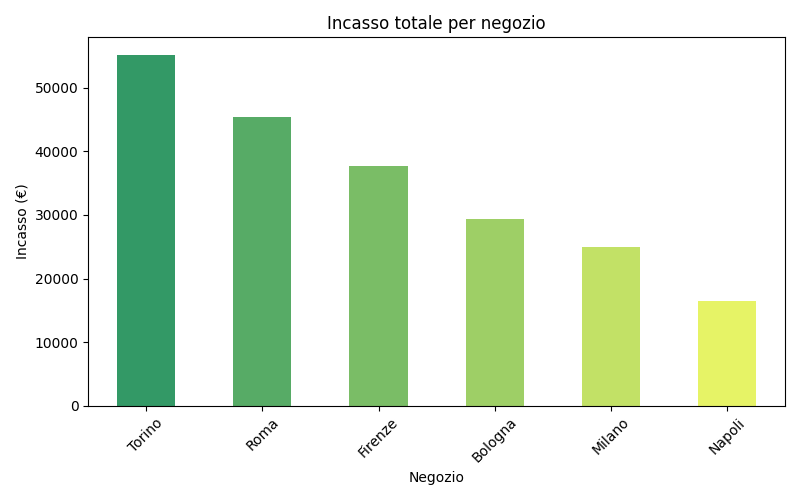
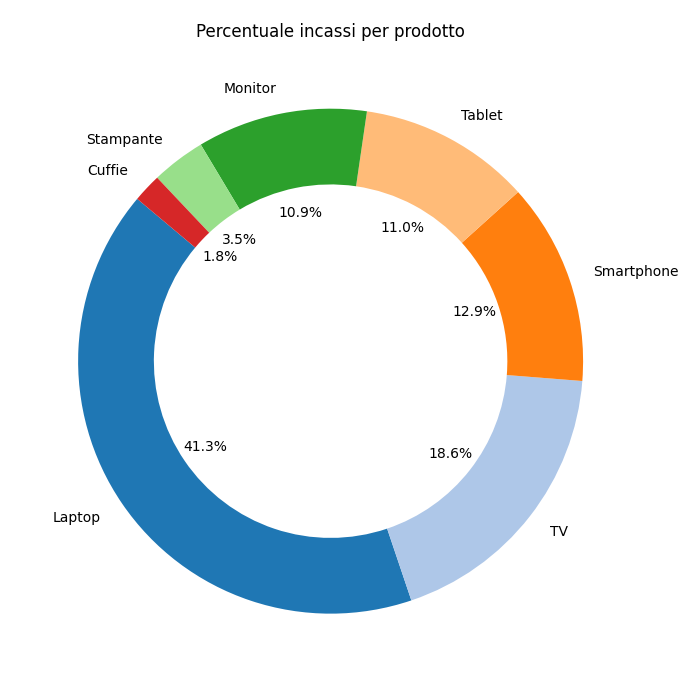

## Descrizione
Questo progetto analizza i dati delle vendite di una catena di negozi di elettronica per migliorare la gestione e capire l'andamento del mercato. 
I dati vengono raccolti giornalmente e comprendono informazioni su prodotti, quantità vendute, prezzo, incassi e negozi. 
Il programma utilizza Python con le librerie NumPy per elaborazioni numeriche veloci, Pandas per la gestione e analisi di dataset e Matplotlib per la visualizzazione dei dati attraverso grafici.

Il codice genera dati sintetici per simulare l'andamento vendite, li elabora per estrarre insights chiave e produce visualizzazioni grafiche per facilitare l'interpretazione dei risultati.

Infine il programma genererà un file CSV (vendite_analizzate.csv) con i dati analizzati e mostrerà i grafici a schermo.

## Dashboard vendite (output atteso)

